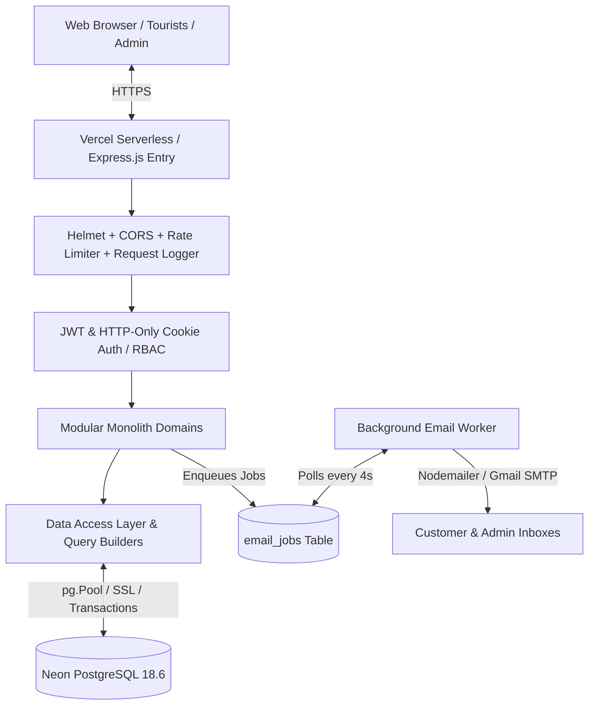

# 01. System Architecture Documentation
## Explore Galiyat — Modular Monolith Platform

---

## 1. Architectural Philosophy
Explore Galiyat is engineered as a high-performance **Modular Monolith** using Node.js, Express.js, and PostgreSQL. It cleanly decouples business domain modules, data access repositories, security layers, and asynchronous background jobs without the operational overhead of microservices.



---

## 2. Directory Structure

```
d:/client project/
├── .github/workflows/ci.yml    # GitHub Actions Continuous Integration
├── .env.example                # Clean environment variable template
├── package.json                # Project dependencies and test scripts
├── server.js                   # Bootloader: DB migrations, background worker, HTTP listener
├── vercel.json                 # Vercel serverless function routing
├── api/index.js                # Serverless entry point
├── public/                     # Static Frontend Client (12 HTML pages, CSS, JS, Assets)
│   ├── index.html
│   ├── admin.html              # Hardened Admin Dashboard with Auth Modal & Server Pagination
│   ├── script.js               # Frontend controller with Idempotency headers
│   └── style.css
├── src/
│   ├── app.js                  # Express middleware pipeline, security & route mounting
│   ├── config/
│   │   ├── env.js              # Environment validator with secret masking
│   │   ├── database.js         # PostgreSQL pool, query runner & transaction helper
│   │   └── logger.js           # Structured JSON logger with sensitive data shielding
│   ├── middleware/
│   │   ├── auth.js             # JWT & Cookie authenticator
│   │   ├── authorize.js        # Role-Based Access Control (admin vs manager)
│   │   ├── securityHeaders.js  # Helmet CSP & HSTS
│   │   ├── cors.js             # Strict CORS whitelist
│   │   ├── rateLimiter.js      # Sliding-window rate limiters
│   │   ├── errorHandler.js     # Centralized error handler with safe production messages
│   │   ├── notFound.js         # Standard 404 JSON responder
│   │   └── requestLogger.js    # Request tracing with X-Request-ID
│   ├── modules/
│   │   ├── auth/               # Admin authentication domain
│   │   ├── bookings/           # Transactions, idempotency & validation
│   │   ├── properties/         # Hotels, villas, room types & amenities
│   │   ├── flights/            # Flight reservation inquiry domain
│   │   ├── admin/              # Metrics, paginated bookings & audit logs
│   │   └── emails/             # Templates & Nodemailer service
│   ├── jobs/
│   │   └── email.worker.js     # Background queue processor with exponential backoff
│   └── database/
│       ├── migrator.js         # Transactional migration runner
│       ├── migrations/         # Versioned SQL migrations (001 to 006)
│       └── seeds/              # Initial admin & property seeder
└── tests/
    ├── unit/
    ├── integration/
    └── security/
```
