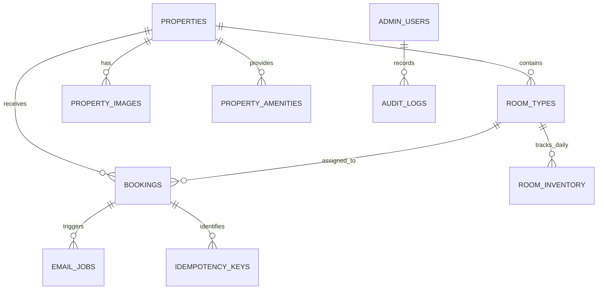

# 03. Database Schema & Migration Guide
## Explore Galiyat — PostgreSQL Relational Model

---

## 1. Entity Relationship Overview

---

## 2. Table Dictionaries

### 2.1 `bookings`
- `id` (VARCHAR 50, PK): Unique reference (e.g. `GB-8F4K29`).
- `uuid_id` (VARCHAR 50, UNIQUE): Internal UUID.
- `guest_name`, `phone`, `email`, `city`, `country`.
- `property_id` (FK -> `properties.id`), `room_type_id` (FK -> `room_types.id`).
- `check_in_date` (DATE), `check_out_date` (DATE).
- `currency` (CHAR 3, 'PKR'), `total_price` (NUMERIC 12,2).
- `status` (VARCHAR 50, 'Pending' | 'Confirmed' | 'Cancelled' | 'Completed').
- `confirmed_at` (TIMESTAMPTZ), `deleted_at` (TIMESTAMPTZ), `deleted_by` (FK -> `admin_users.id`).

### 2.2 `email_jobs`
- `id` (SERIAL, PK)
- `booking_id` (FK -> `bookings.id`)
- `type` (VARCHAR 100): `STAGE1_CUSTOMER_ACKNOWLEDGMENT`, `STAGE1_ADMIN_ALERT`, `STAGE2_CONFIRMATION_VOUCHER`, `CANCELLATION_NOTICE`.
- `recipient_email` (VARCHAR 255)
- `payload` (JSONB)
- `attempt_count` (INT, Default 0), `max_attempts` (INT, Default 3).
- `next_retry_at` (TIMESTAMPTZ), `status` ('PENDING' | 'PROCESSING' | 'SENT' | 'FAILED').

### 2.3 `audit_logs`
- `id` (SERIAL, PK)
- `admin_id` (FK -> `admin_users.id`), `admin_email` (VARCHAR 255).
- `action` (VARCHAR 100): `LOGIN`, `LOGOUT`, `BOOKING_STATUS_CHANGE`, `RESEND_CONFIRMATION`, `SOFT_DELETE_BOOKING`, `ADD_HOTEL`.
- `entity_type` (VARCHAR 100), `entity_id` (VARCHAR 100).
- `old_values` (JSONB), `new_values` (JSONB).
- `created_at` (TIMESTAMPTZ).
