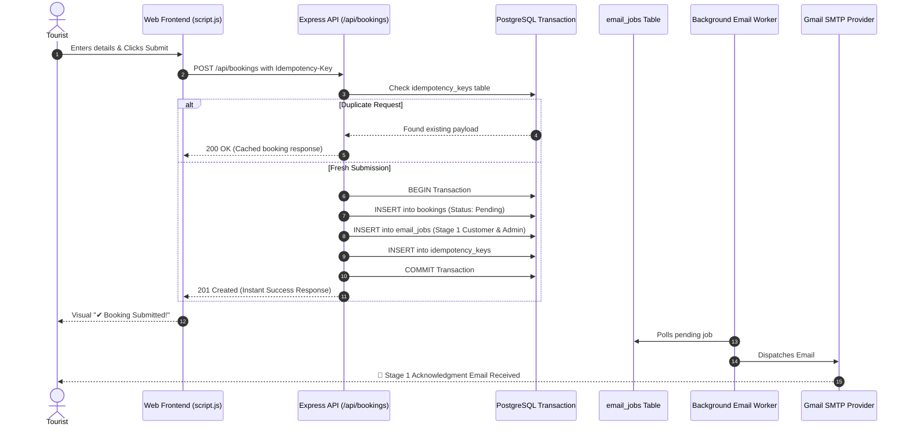

# 06. Booking Transaction & Idempotency Flow
## Explore Galiyat — Transactional Lifecycle

---

## 1. Sequence Diagram

```mermaid
sequenceDiagram
    autonumber
    actor Customer as Tourist
    participant Web as Web Frontend (script.js)
    participant API as Express API (/api/bookings)
    participant DB as PostgreSQL Transaction
    participant Queue as email_jobs Table
    participant Worker as Background Email Worker
    participant SMTP as Gmail SMTP Provider

    Customer->>Web: Enters details & Clicks Submit
    Web->>API: POST /api/bookings with Idempotency-Key
    API->>DB: Check idempotency_keys table
    alt Duplicate Request
        DB-->>API: Found existing payload
        API-->>Web: 200 OK (Cached booking response)
    else Fresh Submission
        API->>DB: BEGIN Transaction
        API->>DB: INSERT into bookings (Status: Pending)
        API->>DB: INSERT into email_jobs (Stage 1 Customer & Admin)
        API->>DB: INSERT into idempotency_keys
        API->>DB: COMMIT Transaction
        API-->>Web: 201 Created (Instant Success Response)
    end
    Web-->>Customer: Visual "✔ Booking Submitted!"
    Worker->>Queue: Polls pending job
    Worker->>SMTP: Dispatches Email
    SMTP-->>Customer: 📩 Stage 1 Acknowledgment Email Received
```
